# Inference Telemetry & Analytics Specification

This document provides a comprehensive technical overview of the **Observable AI Inference Platform's** telemetry ingestion architecture, data pipelines, and analytics aggregate calculations.

---

## 1. High-Level Telemetry Workflow

Whenever a user submits a query to the `/ask` or `/ask/stream` endpoints, a synchronous measurement, filtering, and dual-pipeline persistence process is executed. The diagram below illustrates the detailed request lifecycle and telemetry aggregation flow.

```mermaid
sequenceDiagram
    autonumber
    actor User as Frontend Client
    participant API as FastAPI Backend (rag_app.py)
    participant Wrapper as LLM Wrapper (sdk/llm_wrapper.py)
    participant Redactor as PII Redactor (sdk/pii_redactor.py)
    participant Logger as JSONL Logger (ingestion/logger.py)
    participant DB as MongoDB Client (db.py)

    User->>API: POST /ask (Question + Session ID)
    API->>Wrapper: generate_response(llm, prompt)
    Note over Wrapper: Start perf_counter()
    Wrapper->>Wrapper: Invoke LLM & retrieve metadata
    Note over Wrapper: End perf_counter()<br/>latency_ms = (end - start) * 1000
    Wrapper->>Wrapper: Extract token counts (Groq metadata)
    Wrapper->>Redactor: Pass preview strings for scrubbing
    Redactor-->>Wrapper: Return redacted input/output
    Wrapper->>Logger: log_inference(scrubbed_metadata)
    
    rect rgb(15, 23, 42)
        Note over Logger: Enter threading.Lock()
        Logger->>Logger: Write single line to logs/inference_logs.jsonl
    end
    
    Logger->>DB: insert_log(document)
    alt MongoDB is Active
        DB->>DB: Write document to inference_logs collection
    else MongoDB is Offline
        Note over DB: Timeout in 5000ms<br/>Degrade gracefully
    end
    
    Wrapper-->>API: Return final clean answer
    API-->>User: Return response to client
    
    Note over User: 500ms delay triggers
    User->>API: GET /analytics/summary, /latency, /tokens
    API->>DB: Pull aggregated computations
    DB-->>User: Populate Live Sidebar Analytics Dashboard
```



---

## 2. Ingestion & Data Sanitation Spec

### 2.1 Telemetry Data Schema
Each generated record captures exactly 13 fields mapping to the `InferenceLog` Pydantic schema:

| Field Name | Type | Description | Source / Extraction |
| :--- | :--- | :--- | :--- |
| `request_id` | `str` | Globally unique ID for the request. | `uuid.uuid4()` generator. |
| `session_id` | `str` | Custom identifier grouping chats. | Generated by client `sessionStorage` or defaults to `"default"`. |
| `provider` | `str` | Backend LLM provider. | Hardcoded string (e.g., `"groq"`). |
| `model` | `str` | Model identifier. | Hardcoded model name (e.g., `"llama-3.1-8b-instant"`). |
| `latency_ms` | `float` | Precise request latency in milliseconds. | Computed using high-precision `time.perf_counter()`. |
| `status` | `str` | Final request status: `"success"` or `"error"`.| Caught inside wrapper `try/except` block. |
| `prompt_tokens` | `int` | Input token count. | Extracted from LangChain's response metadata. |
| `completion_tokens`| `int` | LLM token consumption. | Extracted from LangChain's response metadata. |
| `total_tokens` | `int` | Combined token total. | Extracted from LangChain's response metadata. |
| `input_preview` | `str` | Initial 200 characters of the prompt. | Truncated + PII redacted. |
| `output_preview` | `str` | Initial 200 characters of the answer. | Truncated + PII redacted. |
| `error_message` | `str` | Python error trace if request failed. | Captured from wrapper exceptions + PII redacted. |
| `timestamp` | `str` | ISO 8601 UTC time. | Automatically computed using `datetime.now(timezone.utc).isoformat()`. |

### 2.2 PII Redaction Strategy
PII is scrubbed **before** writing to disk or sending to the database, ensuring zero leakage of sensitive data:
- **Emails**: Cleaned using `[\w\.-]+@[\w\.-]+\.\w+` regex -> replaces with `[EMAIL]`.
- **Phone Numbers**: Cleaned using standard international formats -> replaces with `[PHONE]`.
- **Credit Cards**: Cleaned using card matching patterns -> replaces with `[CARD]`.
- **Social Security Numbers**: Cleaned using SSN shapes `\d{3}-\d{2}-\d{4}` -> replaces with `[SSN]`.

---

## 3. Analytics Calculation Logic

The analytics API routes attempt to query MongoDB first. If the database is unreachable, they dynamically fall back to parsing the local `inference_logs.jsonl` file.

### 3.1 Overview Summary Calculations (`/analytics/summary`)
Calculates total requests, failure rate, and total successes.

- **MongoDB Method**:
  Uses optimized document count aggregates:
  $$\text{Total Requests} = \text{collection.count\_documents}(\{\})$$
  $$\text{Total Failures} = \text{collection.count\_documents}(\{\text{"status"}: \text{"error"}\})$$
  $$\text{Successes} = \text{Total Requests} - \text{Total Failures}$$
  $$\text{Success Rate (\%)} = \text{round}\left( \frac{\text{Successes}}{\text{Total Requests}} \times 100, 2 \right)$$

- **JSONL Fallback Method**:
  Python reads the file in reverse, counting lines (capped at 10,000 logs) and counting elements where `status == "error"`.

---

### 3.2 Latency Calculations (`/analytics/latency`)
Calculates Average, Minimum, Maximum, and 95th Percentile (P95) latency for successful requests.

- **MongoDB Method**:
  A single aggregation pipeline computes minimum, maximum, and average:
  ```json
  [
    { "$match": { "status": "success", "latency_ms": { "$ne": null } } },
    {
      "$group": {
        "_id": null,
        "avg_latency_ms": { "$avg": "$latency_ms" },
        "min_latency_ms": { "$min": "$latency_ms" },
        "max_latency_ms": { "$max": "$latency_ms" }
      }
    }
  ]
  ```
  **P95 Percentile Calculation**:
  To avoid requiring MongoDB 7.0+'s percentile operator, it is computed via a highly optimized cursor-level skip:
  $$N_{\text{success}} = \text{collection.count\_documents}(\{\text{"status"}: \text{"success"}\})$$
  $$\text{Index}_{P95} = \max(0, \lfloor N_{\text{success}} \times 0.95 \rfloor - 1)$$
  The system queries all successful latency documents, sorts them ascending, skips exactly $\text{Index}_{P95}$ items, and grabs the value at that cursor limit.

- **JSONL Fallback Method**:
  Filters successful records in memory, sorts the latencies array, and extracts the item at:
  $$\text{Index}_{P95} = \lfloor \text{len(latencies)} \times 0.95 \rfloor$$

---

### 3.3 Token Aggregations (`/analytics/tokens`)
Summates and averages token metrics. (Note: Streaming requests are excluded because token usage counts are returned as `None` for streaming payloads).

- **MongoDB Method**:
  Uses an aggregation pipeline matching successful requests with valid tokens:
  ```json
  [
    { "$match": { "status": "success", "total_tokens": { "$ne": null } } },
    {
      "$group": {
        "_id": null,
        "total_prompt_tokens": { "$sum": "$prompt_tokens" },
        "total_completion_tokens": { "$sum": "$completion_tokens" },
        "total_tokens": { "$sum": "$total_tokens" },
        "avg_prompt_tokens": { "$avg": "$prompt_tokens" },
        "avg_completion_tokens": { "$avg": "$completion_tokens" }
      }
    }
  ]
  ```

- **JSONL Fallback Method**:
  Python loops through JSON lines, summates `prompt_tokens`, `completion_tokens`, and divides by the total non-null row count to generate average consumption counts.

---

### 3.4 Active Sessions (`/analytics/sessions`)
Analyzes active user session workloads, ranking the most active client sessions.

- **MongoDB Method**:
  Groups documents by `session_id`, summates requests, and sorts descending:
  ```json
  [
    {
      "$group": {
        "_id": "$session_id",
        "request_count": { "$sum": 1 },
        "last_seen": { "$max": "$timestamp" }
      }
    },
    { "$sort": { "request_count": -1 } },
    { "$limit": 50 }
  ]
  ```

- **JSONL Fallback Method**:
  Parses all logs in-memory using `collections.Counter` to find frequencies, returning the top 50 sessions.

---

## 4. Graceful Degradation & Resilience

> [!IMPORTANT]
> **Isolation of Ingestion Paths**
> JSONL logging and MongoDB writing are completely independent. A failure in the MongoDB path (due to network drops, authentication timeouts, or database throttling) is caught locally and skipped, leaving the synchronous JSONL logging to handle the write gracefully.

> [!TIP]
> **Database Indexes for Fast Aggregation**
> On startup, the database module automatically ensures three background-optimized indexes:
> - `session_id` index: Accelerates session-level metrics calculations.
> - `timestamp` index: Speeds up time-sorted retrieval.
> - `status` index: Filters successes vs failures rapidly.
